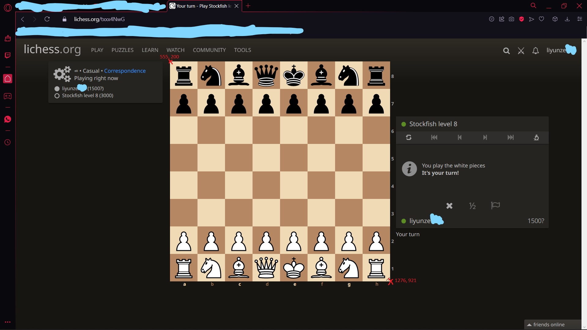
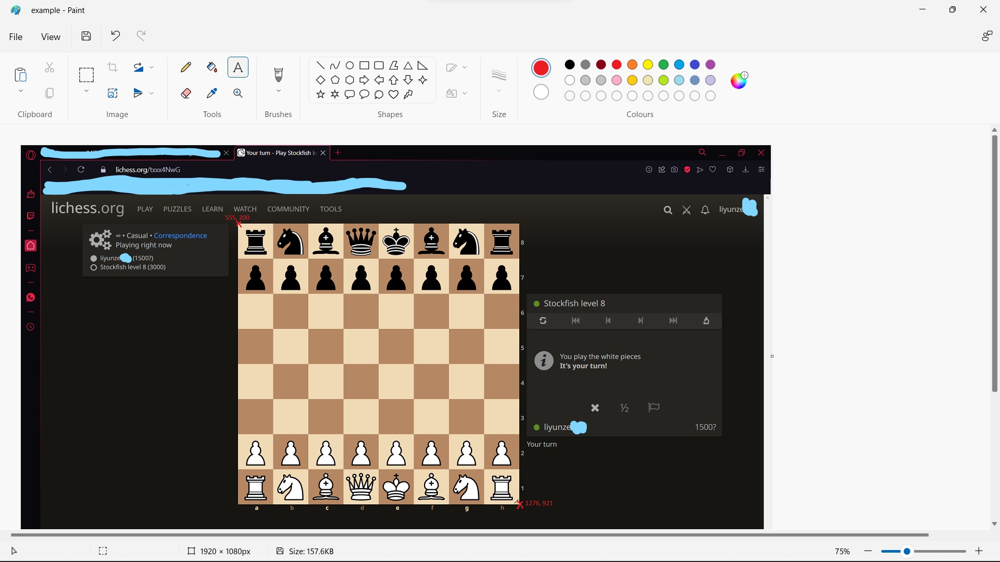

# Chess bot using OpenCV

### version 2.0

---

install requirements via

`pip install -r requirements.txt`

in terminal / command prompt.

---

## How to use

1. Before we start:

-    Size of template images in `piece_templates` must not be larger than the squares in the board.
-    I suggest turning off highlight on check + moving animations so the script can work properly

2. Use Paint or other software to find the correct coordinates

     

     

3. Input the coordinates into the variable `board_bbox` such as
   `board_bbox = (555, 200, 1276, 921)`

4. Run the script, go to lichess and put your mouse on the left side of the screen (not top left or else it will trigger PyAutoGUI's FAIL SAFE)

---

## How it works

This program uses `OpenCV` 's template matching feature. It looks at individual chess pieces from right to left each row, starting from the top left.

When it views an unknown chess piece, it takes confidence value of each template and take the template with the highest confidence value, telling us what chess piece it is.

After identifying all the chess pieces on the board, it gets processed into a chess board (with `python-chess` library)

It then uses `Stockfish` engine (.exe) as a chess engine to generate the best move

After the best move is generated, the program uses math to figure out what coordinates on the desktop the mouse should drag and drop. Using the coordinates, `pyautogui` then executes the mouse input.

---

## License & copyright

© liyunze-coding, student

Licensed under the [MIT License](LICENSE).
